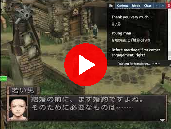

## Universal Game Translator Live

[](https://www.rtsoft.com/files/UniversalGameTranslatorLive_Windows.zip)

[](https://www.youtube.com/watch?v=PFrWheMeT5k)

A complete rewrite of Universal Game Translator with the following features:

* Runs EasyOCR locally via a Python server to facilitate live automatic translations
* All translation is done with Large Language Models (LLMs) (Supports Gemini, ChatGPT, Ollama)
* Can (optionally... it's slower) be run 100% locally by using Ollama with an LLM of your choice
* Powerful easy to use GUI; overlay a chat window where you want (good for lots of dialog like a visual novel) or translate the entire screen
* By sending information on the game being translated and previous context, translations can be more accurate than other methods
* Can speak sentences and create lesson plans

License:  BSD-style attribution, see [LICENSE.md](LICENSE.md)

*Things to know:*

 * This is experimental, mostly tested with Japanese to English translations
 * Windows and NVIDIA cards only (it will probably work with any card, but I don't know if EasyOCR will be hardware accelerated, would likely need to tweak the conda setup .bat)
 * Your privacy is important. The only web calls this app makes are to check this GitHub's media/latest_version_checker.json file to see if a new version is available. Be aware that if you use a cloud service for the translation (Gemini is recommended), they will see what you're translating. If you use Ollama, nothing at all is sent out.
 
## How to install and use it (Windows) ##

* Download the latest version [here](https://www.rtsoft.com/files/UniversalGameTranslatorLive_Windows.zip) and unzip it somewhere

* Do you have Conda?  To check, open a command window (press `Win + R`, type `cmd`, and hit Enter) and type "conda". If it shows conda commands, you already have it installed. If it gives an error, follow the steps below to install Miniconda [(more info)](https://www.anaconda.com/docs/getting-started/miniconda/install#quickstart-install-instructions):
```
curl https://repo.anaconda.com/miniconda/Miniconda3-latest-Windows-x86_64.exe -o .\miniconda.exe
start /wait "" .\miniconda.exe /S
del .\miniconda.exe
```

* Note:  When running .bat files you might get an ugly "This is dangerous, don't run it" message - the .exe itself is signed by RTsoft, but bat files don't have a way to be signed so you'll have to just trust me and click "More info" and run it anyway.  This message only happens the first time per .bat file.

* Conda is a thing that lets us install a bunch of python stuff without screwing up other python installs.  Let's do that now, double click *UGTLive/webserver/SetupServerCondaEnvNVidia.bat* and wait a long time while it installs a bunch of junk.  We need this for EasyOCR, the thing that we run locally to "look" at the screen.  Later, this server might also do more ML/AI work in future versions. (for example, doing subtitles of spoken dialog)

* Did that look like it installed ok?  It runs a self-test at the end.  If it did, you're now ready to run the server.

* Run *UGTLive/webserver/RunServer.bat* (Note: this "server" is only accessible locally by you, if you wanted it available beyond that, edit server.py, it has directions inside)

* Now run *UGTLive/UGTLive.exe*

* Go to the settings and add your Gemini API key.  There is some info written there on how to get it.


* Check out the other settings; the defaults should be ok.  Notice that there is a place to enter the name of the game, this matters!  The LLM knowing this will help it correct errors and create better dialog, as it's more likely to know some weird word is the name of a character, etc.

* Now you should be ready.  Click Start and see what happens!  Click "Log" to see errors and things.  If stuff doesn't work or you have questions, try posting here on GitHub.

NOTE: The first time you use EasyOCR with a newlanguage, it has to download it first!  So it might seem broken, just wait a minute or two and start/stop UGTLive's translation and it should work.

## How to update your version ##

UGTLive will automatically check for updates when you start it. If a new version is available, you'll see a notification asking if you want to download it. To update:

1. Download the latest version from the notification or from [here](https://www.rtsoft.com/files/UniversalGameTranslatorLive_Windows.zip)
2. Close UGTLive if it's running
3. Extract the new files over your existing installation
4. That's it! Your settings and preferences will be preserved

The update process is simple and safe - you won't lose any of your settings or customizations.

## Keyboard Shortcuts for UGTLive

The following shortcuts have been added to UGTLive to help you use the application more quickly and efficiently:

* Main Shortcuts:

| Shortcut  | Function  |
|-----------|-----------|
| Shift+S | Start/Stop OCR |
| Shift+M | Show/Hide Monitor Window |
| Shift+C | Show/Hide ChatBox |
| Shift+P | Show/Hide Settings |
| Shift+L | Show/Hide Log Console |
| Shift+H | Show/Hide Main Window |

## Advanced setup info ##

While personally I recommend Gemini Flash 2 and EasyOCR, there are a lot of options at your disposal.  You can use Windows' built-in OCR instead of the python server, this doesn't work great for Japanese I've found, but might be ok for other languages.  It's fast.

Ollama and ChatGPT are other LLM options. For Ollama, install it, and set a model like gemma3:12b.  On an RTX 4090 it takes around 5 seconds to return a translation.  (the settings contain directions and buttons to get started)  For ChatGPT/OpenAI, choose a model like GPT-4.1 Nano.

Unfortunately I've hardcoded all the models so when new ones come out uh... well, maybe I'll move those to an editable file later.

All the OCR is done at a character-by-character level.  Then there is a "Block detection" function that sticks things together to make words and paragraphs.  You can edit the "Block Power" to make it more likely to stick things together or break them apart.  (Dialog is good stuck together, other things are better not stuck together, so depends on what you're doing)

## Why are you using an LLM instead of DeepL/Google Translate? ##

I think this is the obvious way of the future - by editing the LLM prompt template in settings, you have amazing control.  For example, you can ask it to translate things more literally (good for language learning) if needed. 

It intelligently understands the difference between a block of dialog and three options that the user can choose from and inserts linefeeds at the correct positions.

Another important advantage is spatial understanding - instead of just sending individual lines to be translated, the LLM is sent all the text at once, complete with positioning/rect information.  We allow the LLM to make decisions like "move this text over to that block" or even create its own new blocks.

One key setting is the "Max previous context".  This is recent earlier dialog being sent along with the new request, this allows the LLM to understand "the story thus far" which allows it to give more accurate translations.  In general, you don't want buttons like "Options" "Talk" "X" to be sent in this "context", so the "Min Context Size" allows you to have it ignore smaller words and only send larger dialog.

You can also do dumb things like ask that every character talk like a drunk pirate and that's no problem too.

In the future, we can probably send the entire screenshot directly to an LLM and get answers at a high FPS, but for now, due to speed/cost it makes sense to do our own (lower quality) OCR and send text only.

## For developers - How to compile it ##

* Open the solution with Visual Studio 2022 and click compile.  I can't remember if it's going to automatically download the libraries it needs or not.

* For the python server, I use VSCode to write/debug it.  It's super simple, EasyOCR is doing the heavy lifting. 

## AI usage disclosure ##

Claude code wrote about 90% of this app.  It's weird, AI both makes the job easier and harder - you kind of need to be a REALLY good programmer to go through and fix errors in AI code, but even with that, it saves a ton of time. 

I find myself adding little extras that I'd never bother with pre-AI, like the color and transparency settings of the chat window, that every setting can be done in the app, no weird config.txt files to edit like I normally do.  Programming has changed forever and I like it.

ChatGPT created the logo and the .ico file itself.  It also added the "Play" button to the YouTube screenshot above, it was just faster than opening Photoshop.

## Things that should be added/fixed someday ##

* Use whisper to dynamically generate translated subtitles for spoken dialog
* Figure out how to draw and capture the same part of the screen without ugly flashes
* Make the capture process faster, the "Monitor" window loses FPS on large areas, I haven't even tried to optimize this yet
* I feel like the OCR (both EasyOCR and Windows OCR) should be better; does anybody know what settings/preprocessing I should tweak?
* I've barely tested with anything besides Japanese to English, stuff is probably weird or broken with other languages

**Credits and links**
- Written by Seth A. Robinson (seth@rtsoft.com) twitter: @rtsoft - [Codedojo](https://www.codedojo.com), Seth's blog
- [thanhkeke97](https://github.com/thanhkeke97)
- [EasyOCR](https://github.com/JaidedAI/EasyOCR)
- [Claude code](https://docs.anthropic.com/en/docs/agents-and-tools/claude-code/overview)